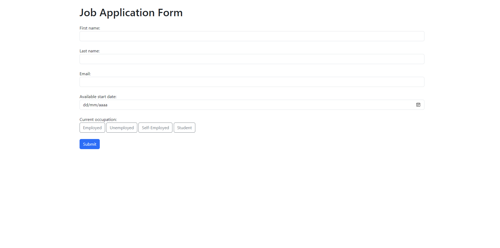

# Job Application Form (Flask)

A minimal Flask web application with an HTML front end created using Bootstrap 5. A confirmation email is sent to the user and the user's data is stored in a SQLite database.

---

### How to use?

* Install the *requierements.txt*
* Create a *.env* file and set the next enviorement variables:
  * *key:* Flask secret key
  * *email:* Gmail address which will serve as the sender
  * *email_password:* *Gmail app password*
* Simply run main.py

---

### Screenshot

